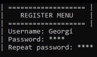
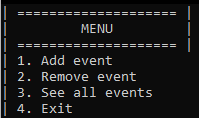

# Plenty

A school project for "Scalefocus" - Create an application for registration
and management of historical events using linked lists in C++.

## CONTRIBUTORS

- Georgi Milev <GNMilev19@codingburgas.bg> (Scrum Trainer)

- Nikola Peshev <NDPeshev19@codingburgas.bg> (Back-End developer)

- Dimitar Grudov <DHGrudov19@codingburgas.bg> (Front-End developer)

- Niya Runcheva <NSRuncheva19@codingburgas.bg> (QA developer)

## PROGRAMS USED
**Visual Studio** - **Creating the program**
**Microsoft Teams** - **Communication**
**Github** - **Uploading and updating the program**

## DEMO OF OUR PROJECT




## INSTALLING ⬇️
You can clone our project using this link:
```https://github.com/NDPeshev19/Plenty.git```
You can open the project by running the **plenty.sln** file

